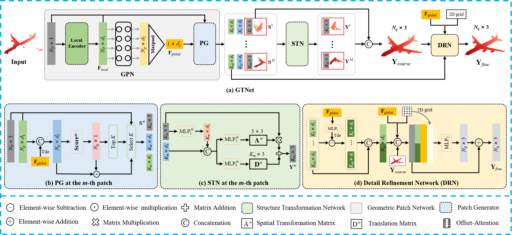

# *GTNet * 
<p align="center"> 

</p>


## [GTNet]
This repository contains the source code for the paper [Learning Geometric Transformation for Point Cloud Completion](https://link.springer.com/article/10.1007/s11263-023-01820-y)


### Installation
Moreover, this repository introduces an integrated Point Cloud Completion Benchmark implemented in Python 3.8, PyTorch 1.8 and CUDA 11.4. 

1. Install dependencies:
+ h5py 3.9.0
+ opencv-python 4.7.0
+ matplotlib 3.7.1
+ transforms3d 0.4.1
+ munch 3.0.0
+ open3d 0.13.0
+ PyTorch 1.8.0
+ PyYAML 5.4.1

2. Compile PyTorch 3rd-party modules ([ChamferDistancePytorch](https://github.com/ThibaultGROUEIX/ChamferDistancePytorch), [emd, expansion_penalty, MDS](https://github.com/Colin97/MSN-Point-Cloud-Completion), [Pointnet2.PyTorch](https://github.com/sshaoshuai/Pointnet2.PyTorch))


### MVP Dataset
Please download the MVP Dataset ([Dropbox](https://www.dropbox.com/sh/la0kwlqx4n2s5e3/AACjoTzt-_vlX6OF9mfSpFMra?dl=0&lst=) or [Google Drive](https://drive.google.com/drive/folders/1ylC-dYFM45KW4K9tPyljBSVyetazCEeH?usp=sharing)) to the folder `data`.


### Usage
+ To train a model: run `python train.py -c *.yaml`, e.g. `python train.py -c pcn.yaml`
+ To test a model: run `python test.py -c *.yaml`, e.g. `python test.py -c pcn.yaml`
+ Config for each algorithm can be found in `cfgs/`.
+ `run_train.sh` and `run_test.sh` are provided for SLURM users. 


## [Citation]
If you find our code useful, please cite our paper:
```bibtex
@article{zhang2023learning,
  title={Learning Geometric Transformation for Point Cloud Completion},
  author={Zhang, Shengping and Liu, Xianzhu and Xie, Haozhe and Nie, Liqiang and Zhou, Huiyu and Tao, Dacheng and Li, Xuelong},
  journal={International Journal of Computer Vision},
  pages={1--21},
  year={2023},
  publisher={Springer}
}
```


## [License]
Our code is released under MIT License.


## [Acknowledgement]
Our code is inspired by [GRNet](https://github.com/hzxie/GRNet) and [VRCNet](https://github.com/paul007pl/VRCNet).
We thank the authors for their great job!